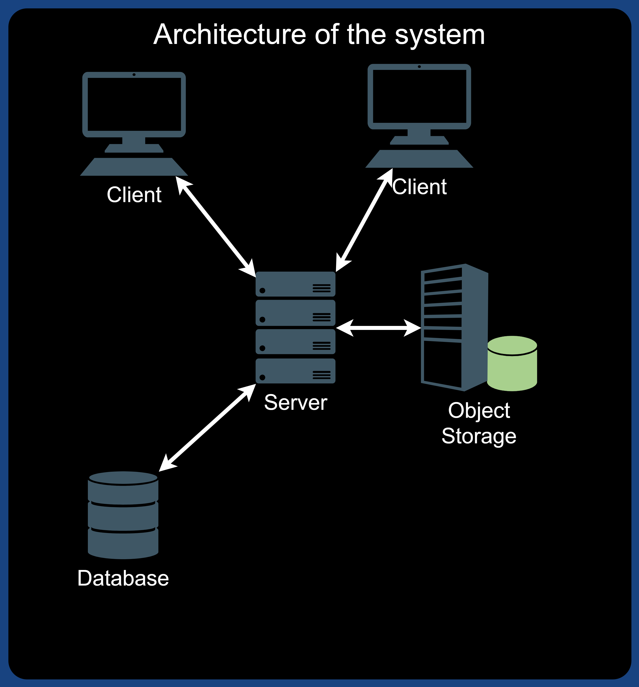
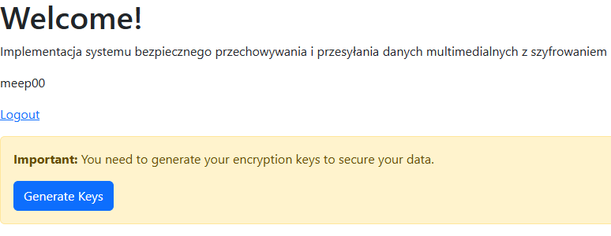
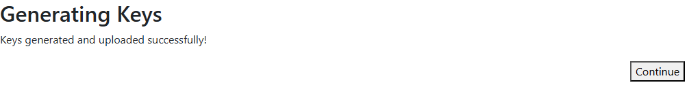
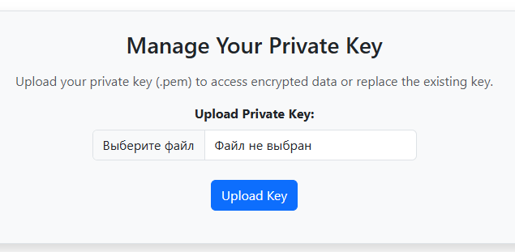
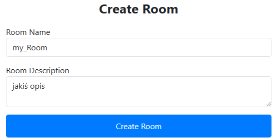
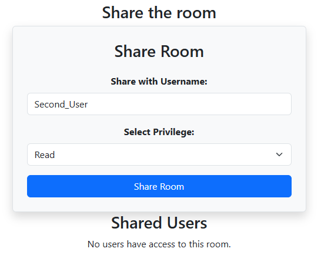
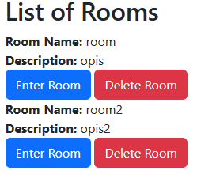
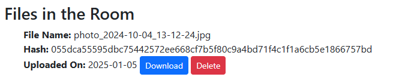

# Wprowadzenie

Projekt jest aplikacją webową stworzonym z użyciem frameworka Django,
bazy danych MySQL, bazy obiektów MinIO i serwera proxy Nginx. Celem
systemu jest przechowywanie plików zaszyfrowanych cały czas z wyjątkiem
klienta, który wykona rzeczywiste szyfrowanie i deszyfrowanie. Wdrożenie
aplikacji realizowane za pomocą konteneryzacji Dockera. Bezpieczeństwo
komunikacji pomiędzy serwerem a klientem jest zapewnione za pomocą
protokołu HTTPS (SSL).

# Wymagania systemowe

-   Docker i Docker Compose (wersja 20.10+)

-   Python (wersja 3.11+)

-   MySQL (w środowisku Dockera)

-   MinIO (w środowisku Dockera)

-   Nginx (w środowisku Dockera)

# Projekt

## Architektura Systemu

System składa się z czterech różnych części: klientów, serwera, bazy
danych i obiektowej pamięci masowej. Przegląd systemu i sposobu
komunikacji części można zobaczyć na
rysunku <a href="#fig:architektura" data-reference-type="ref"
data-reference="fig:architektura">1</a>. Każda część zostanie opisana
bardziej szczegółowo w kolejnych sekcjach.

<figure>

<figcaption aria-hidden="true">Przegląd architektury
systemu</figcaption>
</figure>

## Klient

Strona kliencka jest odpowiedzialna za generowanie asymetrycznej pary
kluczy użytkowników. Służy ona głównie do wymiany kluczy pokojowych.
Część prywatna klucza (privatekey.pem) jest pobierana przez użytkownika.
Dalsze zabezpieczenie klucza prywatnego użytkownika jest obowiązkiem
użytkownika. Część publiczna klucza (publickey.pem) jest wysyłana na
serwer. Będzie ona konieczna przy wymianie kluczem pokojowym pomiędzy
serwerem a nowoautoryzowanym użytkownikiem oraz przy udzielienu dostępu
innym użytkownikom. Również strona kliencka jest odpowiedzialna za
generowanie kluczy pokojowych. Kiedy tworzony jest nowy „pokój”, klient
generuje losowy klucz szyfrujący dla tego pokoju. Klucz ten jest
szyfrowany za pomocą publicznego klucza twórcy pokoju (publickey.pem),
zanim zostanie przesłany na serwer. Strona kliencka także jest
odpowiedzialna za szyfrowanie plików oraz wszystkich towarzyszących
informacji poufnych w tym opis i nazwa pliku. Kiedy plik zostaje
pobrany, klient deszyfruje go kluczem pokojowym.

## Serwer

Serwer działa jako główny punkt komunikacyjny między klientami a innymi
komponentami systemu. Obsługuje wszystkie żądania i sprawdza, czy
użytkownicy mają odpowiednie uprawnienia do wykonywania działań. Serwer
autoryzuje użytkowników, aby upewnić się, że nie są oni podszywaczami.
Kiedy potrzebne są dane, serwer odpytuje bazę danych. Każda operacja
zapisu w bazie danych również przechodzi przez serwer.Jeżeli użytkownik
chce pobrać plik, serwer pobiera go z pamięci obiektowej i dostarcza
użytkownikowi.

## Baza danych

Baza danych przechowuje wszystkie dane i relacje między nimi wymagane
przez system. Dotyczy to informacji o użytkownikach, a także informacji
o tym, którzy użytkownicy mają do których danych dostęp. Baza danych
komunikuje się tylko z serwerem, a wszystkie zapytania do bazy danych są
wykonywane za pośrednictwem serwera.

## Pamięć obiektowa

Wszystkie pliki przesłane do systemu są przechowywane w pamięci
obiektowej w postaci zaszyfrowanej. Metadane związane z plikami również
są tam zapisywane. Każdy plik otrzymuje unikalny identyfikator, który
jest generowany na podstawie zawartości pliku oraz jego metadanych. Ten
identyfikator jest następnie przesyłany na serwer i zapisywany w bazie
danych. Kiedy użytkownik chce pobrać plik, klient wysyła unikalny
identyfikator pliku do serwera, który następnie odpytuje pamięć
obiektową, aby uzyskać odpowiedni plik i dostarcza go użytkownikowi.

## Struktura bazy danych

System korzysta z relacyjnej bazy danych MySQL oraz obiektowej pamięci
masowej MinIO. Tabeli zaimpletowane za pomocą API abstrakcji bazy danych
udostępnionefo przez Django. Poniżej przedstawiono strukturę bazy danych
wraz z opisem poszczególnych tabel.

<figure>

<figcaption aria-hidden="true">Struktura bazy danych</figcaption>
</figure>

#### Tabele Django

  
  
Baza danych zawiera kilka kluczowych tabel dostępnych domyślne po
pierwszej migracji Django, które odgrywają istotną rolę w przechowywaniu
danych systemowych. Tabela `auth_user` jest odpowiedzialna za
przechowywanie podstawowych informacji o użytkownikach, takich jak nazwa
użytkownika, adres e-mail, hasło, status aktywności oraz data utworzenia
konta. Stanowi ona bazową tabelę obsługi użytkowników w aplikacji
Django.

#### Userprofile

  
  
Rozszerzeniem (proxy-tabelą) dla tabeli `auth_user` jest `Userprofile`,
która zawiera dodatkowe informacje, takie jak publiczny klucz
użytkownika oraz odniesienie do głównego wpisu w tabeli `auth_user`.

#### Room

  
  
Tabela `Room` reprezentuje w systemie „pokoje” (grupy), które
użytkownicy mogą tworzyć i współdzielić. Zawiera ona zaszyfrowane
kluczem pokojowym (roomkey) informacje o nazwie pokoju oraz jego opisie.
Dla każdego pokoju generowany jest losowy klucz szyfrujący (roomkey),
który jest zarządzany w tabeli `Access`. Tabela ta przechowuje również
zaszyfrowane kluczem publicznym (publickey.pem) klucze pokojów
(roomkey), przypisane do konkretnych użytkowników, a także ich poziom
dostępu (przywilej).

#### Contains

  
  
Tabela `Contains` określa powiązania między plikami a pokojami,
umożliwiając łatwe odnalezienie plików przypisanych do konkretnego
pokoju.

#### File

  
  
W tabeli plików wszystkie pliki przesłane do pamięci obiektów będą miały
wpis. Tabela plików ma cztery różne atrybuty: nazwa, ścieżka, znacznik
czasu i hash. Atrybuty nazwa i ścieżka są zaszyfrowane za pomocą klucza
pokoju (roomkey). Uniemożliwia to administratorom systemu uzyskiwanie
informacji o danych przechowywanych w systemie. Atrybut znacznika czasu
reprezentuje czas ostatniej modyfikacji pliku. Ten atrybut jest używany,
gdy użytkownik chce przesłać zmodyfikowany plik, aby upewnić się, że
użytkownik ma najnowszą wersję. Atrybut hash zawiera unikalny
identyfikator pliku w pamięci obiektowej. Ten hash służy do pobierania i
przesyłania plików do pamięci obiektów.

# Scenariusze użycia

## Generowanie asymetrycznej pary kluczy użytkownika

Przed rozpoczęciem pracy z systemem zalogowany użytkownik (strona
kliencka) powinien posiadać pewien zbiór kluczy. Asymetryczna para
kluczy jest generowana na stronie klienta poprzez wykonanie skryptu w
języku javascript. Wykorzystany algorytm to RSA-OAEP z długością modułu
klucza 2048 bitów. Testowanie tego scenariuszu oraz kolejnych było
przeprowadzono w przeglądarce Google Chrome version 131.0.6778.205.

<figure>

<figcaption aria-hidden="true">Powiadomienie o potrzebie wygenerowania
pary kluczy</figcaption>
</figure>

<figure>

<figcaption aria-hidden="true">Powiadomienie o pomyślnym wygenerowaniu
kluczy</figcaption>
</figure>

Po pomyślnym wygenerowaniu kluczy część publiczna (publickey.pem) jest
wysyłana na serwer i zapisywana w bazie danych w tabeli `Userprofile` w
polu obecnego użytkownika. Część prywatna (privatekey.pem) jest
automatycznie pobierana przez przeglądarkę na komputerze użytkownika.
Dalsze zabezpieczenie klucza prywatnego użytkownika jest obowiązkiem
użytkownika.  
Za każdym razem, po ponownym zalogowaniu użyktownika, będzie on proszony
o załadowaniu w przeglądarce (session_storage) swojej prywatnej częśći
klucza, aby móc kontynuować pracę z systemem.

<figure>

<figcaption aria-hidden="true">Formularz do zachowania klucza prywatnego
użytkownika</figcaption>
</figure>

## Tworzenie pokoju

Najważniejszym zadaniem przy tworzeniu pokoju jest wygenerowanie kluczu
pokoju, który będzie potrzebny do zabezpiecznia plików oraz wszystkich
towarzyszących informacji poufnych.

<figure>

<figcaption aria-hidden="true">Formularz tworzenia pokoju</figcaption>
</figure>

W tym momencie skrypt generuje klucz pokoju na stronie klienta za pomocą
algorytmu AES-GCM. Przed wysłaniem na serwer jest on szyfrowany
publicznym kluczem użytkownika, co zapewnia niemożliwość jego odczytu
przez stronę, która nie posiada części prywatnej klucza użytkownika.  
Zaszyfrowany klucz pokoju użytkownika i szczegóły o pokoju są następnie
wysyłane na serwer. Serwer wysyła żądanie do bazy danych w celu
utworzenia nowego rekordu w tabeli `Room` zawierający szczegóły związane
z nowym pokojem. Serwer aktualizuje również tabelę dostępu `Access` i
przechowuje zaszyfrowany klucz pokoju wraz z poziomem uprawnień
użytkownika. Po utworzeniu nowego pokoju użytkownik, który go utworzył,
otrzyma przywilej właściciela pokoju.

## Udzielenie dostępu innym użytkownikom

Właściciel zaprasza użytkownika do pokoju po nazwie użytkownika. Nazwa
użytkownika wraz z identyfikatorem pokoju zostanie następnie wysłana na
serwer. Następnie serwer zweryfikuje, czy użytkownik ten, który zażądał
zaproszenia, może w rzeczywistości zaprosić użytkowników do pokoju,
sprawdzając poziom uprawnień. Jeśli użytkownik jest właścicielem,
zaproszony klucz publiczny użytkownika, którego zaproszono do pokoju i
zaszyfrowany klucz pokoju właściciela będą odesłane do klienta.

<figure>

<figcaption aria-hidden="true">Formularz z udzieleniem dostępu do pokoju
innym użytkownikom</figcaption>
</figure>

## Pobieranie pliku

Gdy klient będzie musiał pobrać plik, wyśle zapytanie o dostępne pokoje
do serwera. Serwer tworzy listę pokoi i zaszyfrowanych kluczy pokoju z
bazy danych. Lista jest następnie wysyłana do klienta.
(Rysunek <a href="#fig:listofrooms" data-reference-type="ref"
data-reference="fig:listofrooms">8</a>) Strona kliencka użyje klucza
prywatnego użytkownika (privatekey.pem) do odszyfrowania kluczy pokoju
zawartych na liście w kolejności aby odszyfrować informacje o pokoju.
Gdy użytkownik wybierze plik do pobrania, klient wyślij żądanie do
serwera zawierające odpowiedni identyfikator pliku. Serwer używa
identyfikatora pliku aby pobrać zaszyfrowany plik z pamięci obiektów i
przesłać go do klienta. Klient używa klucza pokoju (roomkey) do
odszyfrowania pliku.

<figure>

<figcaption aria-hidden="true">Wyświetlanie listy dostępnych
pokoi</figcaption>
</figure>

<figure>

<figcaption aria-hidden="true">Wyświetlanie przesłanego
pliku</figcaption>
</figure>

# Instalacja

Aby uruchomić system lokalnie, należy wykonać następujące kroki:

## Klonowanie repozytorium

Skopiuj repozytorium z GitHub:

``` bash
git clone https://github.com/MBYchi/app_project.git
cd app_project
```

## Konfiguracja zmiennych środowiskowych

Utwórz plik `.env` i umieść go w katalogu źródłowym oraz `django/` i
wypełnij go następującymi zmiennymi:

    SECRET_KEY='your_django_secret_key'
    DEBUG=True
    DB_NAME='your_db_name'
    DB_USER='db_user'
    DB_PASSWORD='password'
    DB_HOST='localhost'
    DB_PORT='3306'
    DB_ROOT_PASSWORD='root_pass'
    EMAIL_USE_TLS=True
    EMAIL_HOST='smtp.gmail.com'
    EMAIL_HOST_USER='your_authentication_mailbox@gmail.com'
    EMAIL_HOST_PASSWORD='password'
    EMAIL_PORT=587
    MINIO_ACCESS_KEY=minioadmin
    MINIO_SECRET_KEY=password
    MINIO_BUCKET_NAME=your_bucket
    MINIO_ENDPOINT=localhost:9000

## Struktura katalogów

    app_project/
    ├── django/
    │   ├── admin
    │   ├── encryption
    │   ├── files
    │   ├── m_application
    │   ├── reg_log
    │   ├── static
    │   ├── templates
    │   ├── manage.py
    │   ├── settings.py
    │   ├── .env
    │   ├── ...
    ├── nginx/
    │   ├── certs
    │   ├── Dockerfile
    │   ├── nginx.conf
    ├── docker-compose.yml
    ├── .env
    └── README.md

## Budowanie kontenerów

Uruchom Docker Compose, aby zbudować kontenery:

``` bash
docker-compose up --build
```

# Autorzy

System został opracowany przez **Valiantsin Lambin**, **Maksym Buhai**,
**Ruslan Hedz** dla projektu studenckiego z przedmoitu **Usługi i
aplikacje mobilne**.
